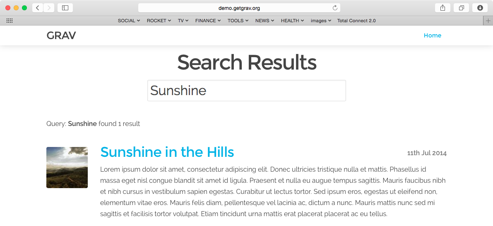

# Grav SimpleSearch Plugin



`SimpleSearch` is a simple, yet very powerful [Grav][grav] plugin that adds search capabilities to your Grav instance.

# Installation

Installing the SimpleSearch plugin can be done in one of two ways. Our GPM (Grav Package Manager) installation method enables you to quickly and easily install the plugin with a simple terminal command, while the manual method enables you to do so via a zip file. 

## GPM Installation (Preferred)

The simplest way to install this plugin is via the [Grav Package Manager (GPM)](http://learn.getgrav.org/advanced/grav-gpm) through your system's Terminal (also called the command line).  From the root of your Grav install type:

    bin/gpm install simplesearch

This will install the SimpleSearch plugin into your `/user/plugins` directory within Grav. Its files can be found under `/your/site/grav/user/plugins/simplesearch`.

## Manual Installation

To install this plugin, just download the zip version of this repository and unzip it under `/your/site/grav/user/plugins`. Then, rename the folder to `simplesearch`. You can find these files either on [GitHub](https://github.com/getgrav/grav-plugin-simplesearch) or via [GetGrav.org](http://getgrav.org/downloads/plugins#extras).

You should now have all the plugin files under

    /your/site/grav/user/plugins/simplesearch

> NOTE: This plugin is a modular component for Grav which requires [Grav](http://github.com/getgrav/grav), the [Error](https://github.com/getgrav/grav-plugin-error) and [Problems](https://github.com/getgrav/grav-plugin-problems) plugins, and a theme to be installed in order to operate.

# Usage

`SimpleSearch` creates a **route** that you define and based on the **taxonomy** filters generates a search result.

To make a search call, this is the URL you would go to:

```
http://yoursite.com/search/query:something
```

1. `/search`: This is the **route** setting and it can be changed
2. `/query:something`: This is the query itself, where `something` is what you are searching for.

To customize the plugin, you frst need to create an override config. To do so, create the folder `user/config/plugins` (if it doesn't exist already) and copy the [simplesearch.yaml][simplesearch] config file in there.

You can also completely customize the look and feel of the results by overriding the template. There are two methods to do this.

1. Copy the file [templates/simplesearch_results.html.twig][results] under your theme templates `user/themes/_your-theme_/templates/` and customize it.

2. Create your very own results output. For this you need to change the `template` reference in the config (let's say **mysearch_results**). In your theme you would then create the new template under `user/themes/_your-theme_/templates/mysearch_results.html.twig` and write your customizations. This is how it looks by default:

    ```
    

    
        <div class="content-padding">
        <h1 class="search-header">Search Results</h1>
        <h3>Query: "{{ query }}" - Found {{ search_results.count }} {{ 'Item'|pluralize(search_results.count) }}</h3>

        
            
        
        </div>
    
    ```

For further help with the `filters` settings, please refer to our [Taxonomy][taxonomy] and [Headers][headers] documentation.

# Config Defaults

```
route: /search
template: simplesearch_results
filters:
    category: blog
```

# Updating

As development for SimpleSearch continues, new versions may become available that add additional features and functionality, improve compatibility with newer Grav releases, and generally provide a better user experience. Updating SimpleSearch is easy, and can be done through Grav's GPM system, as well as manually.

## GPM Update (Preferred)

The simplest way to update this plugin is via the [Grav Package Manager (GPM)](http://learn.getgrav.org/advanced/grav-gpm). You can do this with this by navigating to the root directory of your Grav install using your system's Terminal (also called command line) and typing the following:

    bin/gpm update simplesearch

This command will check your Grav install to see if your SimpleSearch plugin is due for an update. If a newer release is found, you will be asked whether or not you wish to update. To continue, type `y` and hit enter. The plugin will automatically update and clear Grav's cache.

## Manual Update

Manually updating SimpleSearch is pretty simple. Here is what you will need to do to get this done:

* Delete the `your/site/user/plugins/simplesearch` directory.
* Downalod the new version of the SimpleSearch plugin from either [GitHub](https://github.com/getgrav/grav-plugin-simplesearch) or [GetGrav.org](http://getgrav.org/downloads/plugins#extras).
* Unzip the zip file in `your/site/user/plugins` and rename the resulting folder to `simplesearch`.
* Clear the Grav cache. The simplest way to do this is by going to the root Grav directory in terminal and typing `bin/grav clear-cache`.

> Note: Any changes you have made to any of the files listed under this directory will also be removed and replaced by the new set. Any files located elsewhere (for example a YAML settings file placed in `user/config/plugins`) will remain intact.

[taxonomy]: http://learn.getgrav.org/content/taxonomy
[headers]: http://learn.getgrav.org/content/headers
[grav]: http://github.com/getgrav/grav
[simplesearch]: simplesearch.yaml
[results]: templates/simplesearch_results.html.twig
